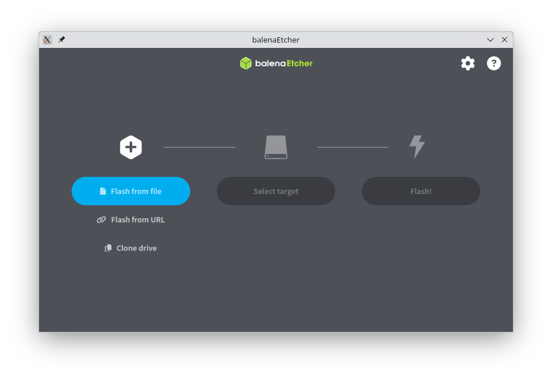
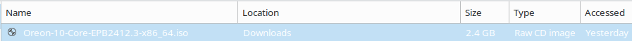

# Installing Oreon

This guide applies to Oreon 10 and later, please refer to the legacy installation documentation for Oreon Lime (R2). https://oreonproject.org/installing-oreon/

## Requirements

- A bootable Oreon ISO image downloaded from https://oreonproject.org/download/
- USB storage device (4 GB minimum)
- Balena Etcher from https://etcher.balena.io/

## Oreon System Requirements
**Applies to Oreon 10**

- x86_64 or aarch64 CPU
- 1.5 GB memory or more
- 20 GB storage or more

:::warning
If the Oreon installation fails, your machine is likely unsupported.
:::

## Creating a Bootable USB

After you have your ISO image downloaded and you have Balena Etcher up and running, you have to flash the ISO image to your USB storage device to make it bootable for your machine.

:::danger
All data on your USB storage device will be erased, please back up any important data before proceeding.
:::

Once you've launched Balena Etcher, it should look something like this.

Upload your ISO image by selecting 'Flash from file' which then you upload the Oreon ISO image.

